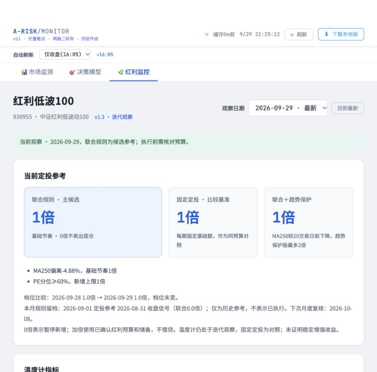

# 红利监控验收记录

核验日期：2026-09-29。规则：本目录冻结的 `DIVIDEND-RULES-v1.3.md`。

- 14项Python测试通过，涵盖3331日已核验历史逐日对照、阈值、停投优先、756样本预热、独立价格/全收益均线、无未来观察影响、国债向后对齐、节假日、日期不一致、缺失、超时及原更新字段保留。
- 页面状态测试通过：陈旧或读取失败时撤下当前倍数；历史观察保留；当前PE缺失显示暂停新增、PE待核；刷新保持独立日期选择。
- 原市场页、决策页的完整内容，以及 `renderDecisionModel`、`renderETFCategories` 函数与修改前逐字一致。原快照的各数据字段一致；原有定时更新推进了生成时间。
- 本地只读 `/dividend` 接口返回200，规则版本1.3。实时官方数据更新至2026-09-29，联合候选1倍，趋势保护1倍。
- 浏览器验证第三分页点击切换、直接访问 `#dividend`、重新载入及刷新。选择2026-09-17历史日期后，原大盘拥挤度26分、仓位区间70–85%保持一致；刷新仍保留历史选择。重载恢复红利分页和最新观察。
- 默认桌面及390×844窄屏检查通过。窄屏页面宽度390，无整页横向溢出；三组图表可见，ETF表单独横向滚动；浏览器无错误日志。

当前数据限制：ETF份额最新可得日为2026-09-28，对比2026-07-02。515480缺少窗口起点，保持缺失，不计为零；全品类变化合计不输出。四只产品及官方跟踪指数核验链接在页面展示。ETF陈旧或失败不影响红利核心指标。

历史原始数据与首次导入验证、输入哈希保存在 `data/dividend/seed-manifest.json`；后续官方请求和输入哈希保存在 `refresh-manifest.json`。分红始终标为代理指标，保持“迭代观察”。

